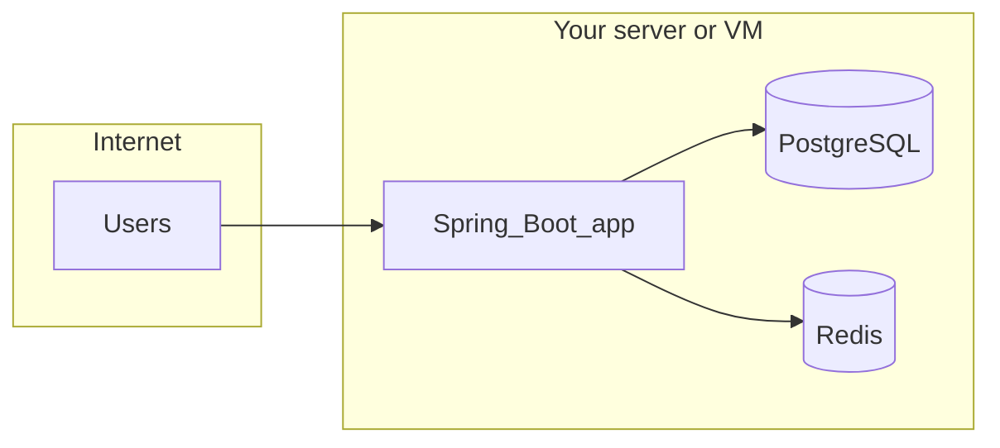

# Hosting workflow: GitHub to production

This document explains the **end-to-end path** from putting the project on GitHub to running it on a server. For deep AWS (EC2, ALB) steps, see [DEPLOYMENT_GUIDE.md](DEPLOYMENT_GUIDE.md).

---

## 1. Put the code on GitHub

1. **Initialize Git** (if the folder is not a repo yet):
   ```bash
   git init
   git add .
   git commit -m "Initial commit"
   ```
   The repo already includes a `.gitignore`; keep it.

2. **Create a repository** on GitHub (empty: no README, no `.gitignore`, if you are pushing an existing project—avoids a merge conflict on first push).

3. **Add the remote and push**:
   ```bash
   git remote add origin https://github.com/<your-username>/<your-repo>.git
   git branch -M main
   git push -u origin main
   ```

4. **Secrets**: Do **not** commit database passwords, API keys, or production `APP_BASE_URL` with real domains if they embed secrets. Use environment variables on the host, GitHub Actions secrets for CI, or your cloud’s secret manager.

5. **Optional**: Protect `main`, require pull requests, and enable branch protection rules for collaboration.

---

## 2. What “hosting” means for this app

You must run **three** pieces somewhere reachable (same machine is fine):

| Component   | Role                                      |
|------------|--------------------------------------------|
| Spring Boot app | HTTP API, redirects, rate limiting, cache |
| PostgreSQL | Persistent URL mappings (Flyway migrates on startup) |
| Redis      | Caching and rate-limit counters           |



This repository is set up for **Docker Compose** (one command starts all three). Production is usually: **VPS or EC2 + Docker Compose**, optionally behind a reverse proxy and load balancer.

---

## 3. Path A: VPS + Docker Compose (simplest mental model)

1. **Provision a Linux VM** (e.g. DigitalOcean, Linode, Hetzner, or AWS EC2 acting as a plain VPS).

2. **Install Docker Engine and Docker Compose** (official docs for your distro).

3. **Clone your GitHub repo** on the server:
   ```bash
   git clone https://github.com/<your-username>/<your-repo>.git
   cd <your-repo>
   ```

4. **Set environment variables** for production (at minimum):
   - Strong `POSTGRES_PASSWORD` (override the compose default).
   - **`APP_BASE_URL`** = your public URL, e.g. `https://short.example.com`, so generated `shortUrl` values are correct for users.

   You can export variables before `docker compose up`, use a `.env` file (not committed), or a `docker-compose.override.yml` as described in [DEPLOYMENT_GUIDE.md](DEPLOYMENT_GUIDE.md).

5. **Firewall**: Open **80** and **443** for the reverse proxy. The app is published on the host per [docker-compose.yml](../docker-compose.yml) (default **`8021:8080`**—see [Port mapping note](#6-port-mapping-note-docker-compose-vs-readme-legacy) below).

6. **Start the stack**:
   ```bash
   docker compose up -d --build
   ```

7. **HTTPS**: Put **Caddy** or **nginx** in front. Typical pattern: terminate TLS on 443, proxy to `http://127.0.0.1:8021`. Only the proxy needs to be public; you can bind the app to localhost if you adjust compose port publishing.

8. **Verify**:
   ```bash
   docker compose ps
   curl http://localhost:8021/actuator/health
   ```

---

## 4. Path B: AWS (EC2 + ALB)

Use **[DEPLOYMENT_GUIDE.md](DEPLOYMENT_GUIDE.md)** for step-by-step EC2, security groups, Application Load Balancer, and optional `docker-compose.override.yml`.

**Before you follow that guide:**

- [ ] Code is on GitHub (or you have another way to get the image/sources onto EC2).
- [ ] You know your production domain and will set `APP_BASE_URL` to `https://your-domain.com`.
- [ ] You will use strong passwords for Postgres (and Redis if you enable `requirepass` in overrides).
- [ ] Target group / security group ports match the **host** port you publish (default **8021** in compose; the app listens on **8080** inside the container). See [DEPLOYMENT_GUIDE.md](DEPLOYMENT_GUIDE.md) ALB section.

---

## 5. Optional: CI/CD from GitHub

You do not need this on day one. A common pattern:

1. **GitHub Actions** runs on push to `main`: build the Docker image, push to a registry (**GHCR**, **Amazon ECR**, etc.).
2. **Deploy**: SSH to the server and run `docker compose pull && docker compose up -d`, or call a small deploy webhook/script.

Keep registry credentials and SSH keys in **GitHub Actions secrets**, not in the repo.

---

## 6. Port mapping note (Docker Compose vs. local `bootRun`)

- **[docker-compose.yml](../docker-compose.yml)** maps **`8021:8080`**: browser/API clients use **`http://localhost:8021`**. Inside the container the app listens on **8080** (`application-docker.yml` overrides `application.yml`).
- **`./gradlew bootRun`** (with Postgres/Redis from Compose) still uses **`http://localhost:8081`** from [application.yml](../src/main/resources/application.yml).

---

## Quick reference

| Step              | Action |
|-------------------|--------|
| Source of truth   | GitHub repo |
| Run in production | `docker compose up -d --build` on a server |
| Must configure    | `APP_BASE_URL`, strong DB password |
| Health check      | `GET /actuator/health` |
| Deep AWS steps    | [DEPLOYMENT_GUIDE.md](DEPLOYMENT_GUIDE.md) |
